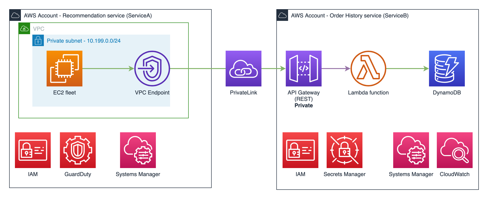

# Zero Trust Workshop - Service2Service Episode - Code
This repository contains the source code, AWS environment build, of the [Zero Trust Service2Service Workshop](https://zerotrust-service2service.workshop.aws/) workshop. It does not contain the source code of the workshop's website.

<!-- TODO: describe what this creates  -->
There are two main CDK stacks in this code:
- ServiceA
- ServiceB

<!-- TODO update diagrams -->
High Level Architecture:  



# How To Use 

## Requirements
-  python3
- node
- aws-cdk

## Steps
1. Clone this repo & `cd aws-zerotrust-service2service-workshop`

1. Create and activate virtual environment:
    ```bash
    python3 -m venv .venv
    source .venv/bin/activate
    ```

1. Once the virtual environment is activated, install the required dependencies:

    ```bash
    pip install -r requirements.txt
    ```

1. You should now be able to run CDK commands. Start by listing available stacks:
    ```bash
    cdk ls
    ```

1. For example, if you want to synthesize the CloudFormation template for a stack:
    ```bash
    cdk synth <StackName>
    ```

### Specific to this app
```bash
# While in the root directory of this repo:
pip3 install aws_requests_auth -t src/lambda/layer/python
```
Why? I create a Lambda layer that contains the `aws_requests_auth` package used by Lambda functions. I avoid pushing the package's files to the repo (.gitignore). So you need to pip install the package after cloning this repo. Then at `cdk deploy` time CDK uses packages installed in `./src/lambda/layer/python` to create the Lambda Layer.

<!-- TODO instruction for:
    lambda from asset vs. bucket
    deploy locally, bootstrap, etc.
-->

## Useful commands

 * `cdk ls`          list all stacks in the app
 * `cdk synth`       emits the synthesized CloudFormation template
 * `cdk deploy`      deploy this stack to your default AWS account/region
 * `cdk diff`        compare deployed stack with current state
 * `cdk docs`        open CDK documentation


 ## Repo structure
This project is initialized by `cdk init` and has the standard structure of a Python project.

<!-- TODO: complete -->
```markdown
.
├── app.py                                  <-- The entry point for this application.
├── config.yml                              <-- [Not a CDK thing] Static variables used in this app.
├── README.md                               <-- This instructions file
├── setup.py                                <-- 
├── src                                     <-- Directory for Lambda and EC2 source codes
└── zerotrust_service2service_workshop      <-- Directory for main CDK stacks

```

## Security

See [CONTRIBUTING](CONTRIBUTING.md#security-issue-notifications) for more information.

## License

This library is licensed under the MIT-0 License. See the LICENSE file.
